 

  

 

---

## &nbsp;✦&nbsp; hey, i'm lalit

I'm drawn to problems that live at the edge of what AI can currently do.

Agentic systems that plan across multiple steps. RAG pipelines that understand context rather than just retrieve it. Real-time anomaly detectors that surface what humans would miss. That's the space I work in — and it never gets boring.

I came into AI through research — medical imaging, financial ML, big data in healthcare — and landed in production engineering. I do both now, and I think that's the most interesting place to be: where a paper becomes a system that runs under real load, serves real users, and changes real decisions.

When I'm not building, I'm studying for the CFA — because the better you understand the domain your models serve, the sharper your work becomes.

 

---

## &nbsp;✦&nbsp; what i'm working on

| | Project | What it does |
|:--:|---------|--------------|
| 🧠 | **ClawMetrics** | Agentic analytics engine — natural language in, dashboards and insights out. 13 custom tools over ClickHouse/PostgreSQL |
| 🎙️ | **[Intellecto](https://github.com/Shrotriya-lalit/AI-Interview-Platform)** | AI-powered interviews — real-time voice, ML scoring, anti-cheat. Won Thrive-A-Thon 1.0 |
| 👁️ | **VisionGen3D** | 3D face synthesis from scratch — Style-GAN meets NeRF, built for defense use-cases |
| 🔗 | **OpenPanel OSS** | BigQuery connector + API enhancements for the open-source analytics platform |

 

---

## &nbsp;✦&nbsp; the craft

**Languages · Data · ML**

 

**Generative AI · LLMs · Agents**

 

**Backend · Infra · Cloud**

 

---

## &nbsp;✦&nbsp; github stats

  
  

 

  

 

---

## &nbsp;✦&nbsp; recent activity

<!--START_SECTION:activity-->
1. 🗣 Commented on [#93](https://github.com/NVIDIA/SkillSpector/pull/93#issuecomment-4777469133) in [NVIDIA/SkillSpector](https://github.com/NVIDIA/SkillSpector)
2. 💪 Opened PR [#96](https://github.com/NVIDIA/SkillSpector/pull/96) in [NVIDIA/SkillSpector](https://github.com/NVIDIA/SkillSpector)
3. 💪 Opened PR [#95](https://github.com/NVIDIA/SkillSpector/pull/95) in [NVIDIA/SkillSpector](https://github.com/NVIDIA/SkillSpector)
<!--END_SECTION:activity-->

 

---

## &nbsp;✦&nbsp; contributions

  
  

 

  
  

 

  

 

  <picture>
    <source media="(prefers-color-scheme: dark)" srcset="https://raw.githubusercontent.com/Shrotriya-lalit/Shrotriya-lalit/output/github-snake-dark.svg" />
    <source media="(prefers-color-scheme: light)" srcset="https://raw.githubusercontent.com/Shrotriya-lalit/Shrotriya-lalit/output/github-snake.svg" />
    
  </picture>

 

---

## &nbsp;✦&nbsp; things i've written

| Paper | Venue | Year |
|-------|-------|------|
| [Apache Spark in Healthcare: Data-Driven Innovations](https://dx.doi.org/10.14569/IJACSA.2023.0140665) | IJACSA · Q3 · 16 citations | 2023 |
| [Real-Time Data Analysis: Architectures for Decision-Making](https://scholar.google.com/citations?user=90FqbB0AAAAJ) | IEEE ICPEEISC · 7 citations | 2023 |
| [Brain Tumor Detection Using Advanced Deep Learning](https://doi.org/10.18280/ts.400508) | IIETA Traitement du Signal · Q3 | 2023 |
| [Pneumothorax Detection: Mask-RCNN + Transfer Learning](https://doi.org/10.1016/j.mex.2024.102692) | Elsevier MethodsX · Scopus Q1 | 2024 |
| [Deep Learning for Hedging in Derivative Markets](https://doi.org/10.1109/ICISAA62385.2024.10829090) | IEEE ICISAA | 2024 |

  7 publications &nbsp;·&nbsp; 25+ citations &nbsp;·&nbsp; h-index 2 &nbsp;·&nbsp; <a href="https://scholar.google.com/citations?user=90FqbB0AAAAJ&hl=en">Google Scholar</a> &nbsp;·&nbsp; <a href="https://www.researchgate.net/profile/Lalit_Shrotriya">ResearchGate</a>

 

---

## &nbsp;✦&nbsp; a few things i'm proud of

- won a firm-wide AI hackathon with an interview platform built in days, not weeks
- published in elsevier (Q1), ieee and iieta before graduating
- ranked 2nd in my AI/ML program &nbsp;·&nbsp; topped business management
- systems i've built are saving real money and handling real traffic
- google cloud certified in generative AI

 

